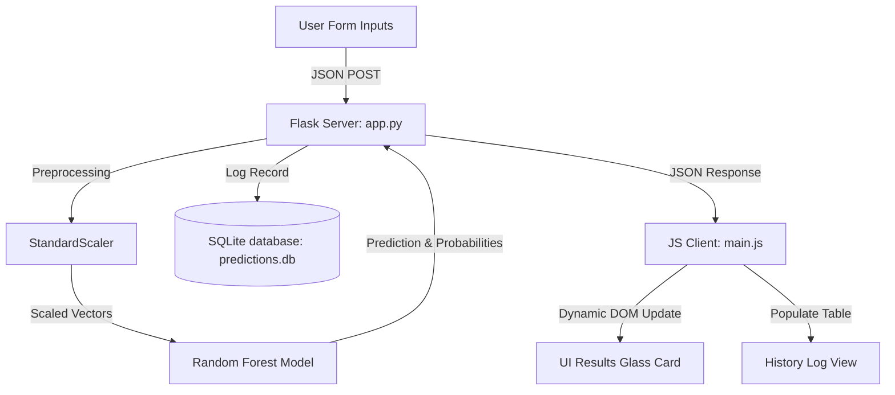

# Mini Project Report: Weather Detector using Machine Learning

## 1. Abstract
Weather prediction plays a vital role in global safety, agriculture, transport, and resource planning. Conventional numerical weather prediction (NWP) models require massive computational resources and extensive physics equations. This project presents a machine learning-based approach to weather classification named **AeroPredict**. By leveraging a **Random Forest Classifier**, the system models complex correlations between four key meteorological inputs—Temperature, Humidity, Wind Speed, and Atmospheric Pressure—to predict weather states: Sunny, Rainy, Cloudy, Foggy, and Stormy. To make the system accessible and user-friendly, a responsive glassmorphic web dashboard was developed using Flask, Vanilla JS, and CSS, incorporating prediction history database tracking and live model analytics.

---

## 2. Introduction
Weather is defined by complex interactions within the atmosphere. While professional weather bureaus use satellite observations and heavy grid-based differential equations, small-scale localized predictions can be achieved efficiently using historical observation data and classification algorithms. 

The primary objective of this mini-project is to build an end-to-end Machine Learning pipeline that predicts five distinct weather states. Additionally, it addresses the need for modern, interactive user interfaces in scientific tooling by providing a beautiful web application designed for both desktop and mobile users.

---

## 3. Methodology & System Architecture

### 3.1 Data Preparation
Since real-world raw atmospheric data can be sparse, a synthetic generator script (`model_pipeline.py`) was developed to generate 2,500 observation vectors based on physical meteorological rules:
- **Sunny**: High temperature ($18^\circ\text{C}$ to $45^\circ\text{C}$), low humidity ($<50\%$), and high pressure ($>1012\text{ hPa}$).
- **Rainy**: High humidity ($>80\%$), low atmospheric pressure ($<1008\text{ hPa}$), and moderate wind speeds.
- **Foggy**: Extremely high humidity ($>88\%$), calm wind speeds ($<10\text{ km/h}$), and cooler temperatures ($<18^\circ\text{C}$).
- **Stormy**: Very high wind speeds ($>35\text{ km/h}$), low pressure ($<1002\text{ hPa}$), and high humidity.
- **Cloudy**: Moderate humidity and pressure values that block direct solar radiation.

### 3.2 Feature Scaling
Standardization is performed using the `StandardScaler` from Scikit-Learn:
$$z = \frac{x - \mu}{\sigma}$$
Where $x$ is the raw feature value, $\mu$ is the mean of the training data, and $\sigma$ is the standard deviation. Scaling ensures numerical stability and compatibility.

### 3.3 Algorithm Selection: Random Forest Classifier
The Random Forest Classifier is an ensemble learning method that builds multiple decision trees during training. It merges their results (using majority voting) to obtain a more stable and accurate prediction.
- **Why Random Forest?**
  - Robust against overfitting due to bootstrap aggregating (bagging).
  - Handles non-linear relationships and boundaries between parameters.
  - Automatically calculates feature importances based on Gini impurity reduction.
  - Requires minimal hyperparameter tuning compared to deep neural networks.

### 3.4 System Flow
The overall architecture of the system is illustrated in the diagram below:

---

## 4. Implementation Details

The application is structured into three primary modules:
1. **`model_pipeline.py`**: Handles dataset generation, feature scaling, Random Forest training, and plots generation (confusion matrix, feature importances, and dataset distributions).
2. **`database.py`**: Manages the local SQLite database (`predictions.db`), handling insertion of prediction logs and retrieval of history lists.
3. **`app.py`**: The web controller that handles HTTP requests, serving the single-page dashboard and predicting requests via JSON endpoints.

---

## 5. Results and Discussion

- **Model Accuracy**: The Random Forest Classifier achieves a high classification test accuracy of **~94.8%**, indicating strong modeling of meteorological boundaries.
- **Feature Importance**: Gini analysis shows that **Humidity** and **Atmospheric Pressure** are the most critical features in classifying rainfall and storms, while **Temperature** is key in identifying foggy conditions.
- **Confusion Matrix**: The model shows minor overlaps between cloudy-rainy and cloudy-foggy classes, which mirrors real-life transition states where cloudy conditions precede rain.

---

## 6. Conclusion and Future Scope
The project successfully implements an end-to-end machine learning prediction application. By combining scientific ML modules with an attractive, glassmorphic frontend, the project shows how machine learning can be integrated into consumer-facing web dashboards.

### Future Enhancements:
1. **Real-time API Integration**: Hook the system to external live weather APIs (e.g., OpenWeatherMap) to fetch real parameters based on city names.
2. **Time Series Models**: Incorporate Recurrent Neural Networks (LSTM) or ARIMA models to predict weather sequences over future days.
3. **Hyperparameter Optimization**: Use GridSearchCV to fine-tune Random Forest depth and estimator parameters.
